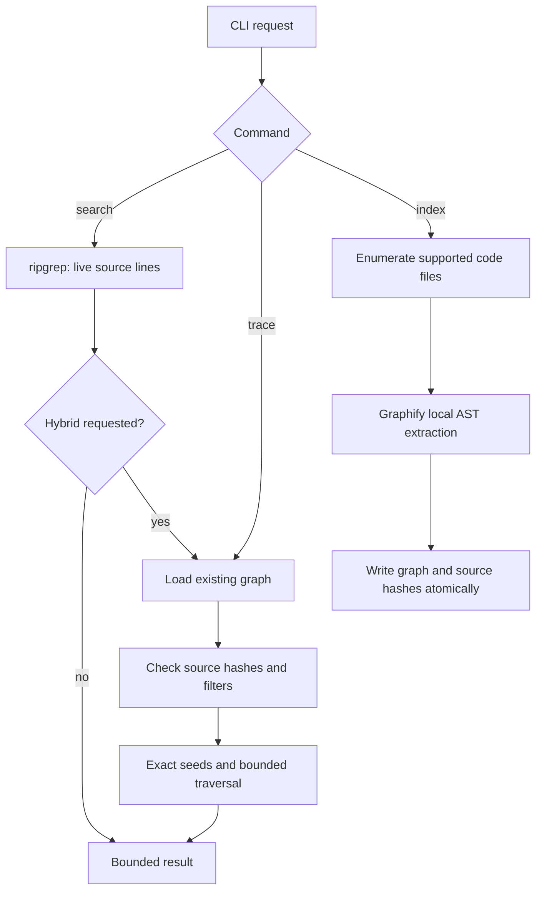

# Grephty implementation notes

The CLI lives in `graphify/grephty.py`; retrieval lives in `graphify/hybrid.py`.
Both are additive to the upstream Graphify package. The new console script is
`grephty`; existing `graphify` entry points retain their behavior.

## Routing

No natural-language classifier guesses intent. Source search is the default;
the caller explicitly chooses graph expansion. Hybrid mode keeps the source
matches even if graph loading fails. Graph traversal never expands a whole
community just because it contains a matching symbol.

## Source search

Use `rg --json`, without a shell and without user ripgrep configuration, to keep
patterns literal by default and the output protocol stable. Stream stdout and
stop after finding one more result than the requested limit. This establishes
truncation without buffering every match. Stderr uses a temporary file to avoid
pipe deadlocks. A timer kills searches that exceed 30 seconds.

The JSON includes relative file paths, one-based line numbers, exact text
snippets, one-based snippet starting columns, and explicit clipping/truncation
flags. The text formatter renders the same records. A match count counts matching
lines, not individual occurrences on a line. Non-UTF8 records that ripgrep encodes
as base64 are not rendered as source evidence.

## Graph construction and traversal

Indexing enumerates supported code files with ripgrep and calls
`graphify.extract.extract(paths, root=root, cache_root=..., parallel=False)`.
The index uses raw nodes and edges, without community clustering or semantic
extraction. Hash snapshots before and after extraction detect files changing
during a build; in that case the previous graph is preserved. Extraction failures
are carried through to the result and subsequent query warnings.

Graph readers accept both raw `edges` and NetworkX-style `links` arrays. Edge
source and target fields preserve relationship direction even when a serialized
graph says `directed: false`. Breadth-first traversal respects direction, relation,
confidence, hop, and result-count filters. It handles cycles and parallel edges.
Duplicate labels are reported, with `--file` or full IDs available to disambiguate.

Hash verification covers the current supported code inventory, including added
and deleted files. It is deliberately conservative: a change anywhere in that
inventory marks a Grephty index stale. Imported graphs without hashes cannot be
certified fresh. Even a fresh index is a static analysis result, not runtime proof;
dynamic dispatch and unsupported languages can leave gaps.

## Validation scope

`tests/test_grephty.py` exercises real ripgrep and Python AST extraction plus graph
fixtures for directional traversal, cycles, parallel edges, evidence filtering,
bounded output, ambiguous seeds, missing/corrupt graphs, ignored files, symlinks,
stale indexes, and CLI error statuses. The example is a reproducible demonstration,
not an evaluation of the private project described by the user.

Future work should use measured tasks before adding automatic routing, PDF text
ingestion with page citations, or adaptive output budgets. Count source evidence,
irrelevant results, latency, and model-specific tokens separately; there is no
universal graph compression factor.
